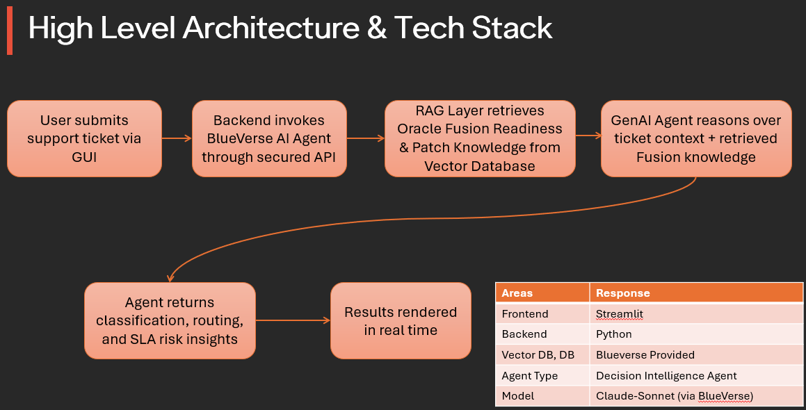

# AI‑Driven Ticket Operations Agent

An AI-powered ITSM assistant that automatically classifies support tickets, routes them to the correct resolver groups, predicts SLA breach risk, and identifies Oracle Fusion patch‑related impact using an agent built on BlueVerse.

---

## Features

- Auto ticket classification (Module, Ticket Type, Severity, Priority)
- Resolver group recommendation
- SLA breach risk prediction with confidence score
- Recurring issue detection and escalation to Problem Management
- Patch impact analysis for Oracle Fusion quarterly updates
- Supports **single ticket analysis** and **batch Excel upload**
- Streamlit UI for interactive demo and CSV/Excel output

---

## Architecture Overview



High‑level flow:
1. User inputs ticket text OR uploads Excel file
2. Streamlit UI sends ticket data to BlueVerse AI Agent
3. Agent performs ITSM reasoning and Oracle Fusion context analysis
4. Post‑processing layer normalizes output for analytics and exports
5. Results displayed in UI and downloadable as CSV

---

## Setup & Installation

Follow the steps below to set up and run the AI‑Driven Ticket Operations Agent locally.

### 1. Prerequisites
- Python 3.9 or higher
- pip (Python package manager)
- Internet access to call the BlueVerse API

---

### 2. Clone the Repository
```bash
cd smart-ticket-ops-agent
```

### 3. Install Dependencies
```bash
pip install -r requirements.txt
```

### 4. Run the application
```bash
python -m streamlit run app.py 
```
OR
```bash
streamlit run app.py 
```


## Prompt Engineering Strategy

The agent uses a structured, deterministic prompt that enforces:
- Flat JSON output schema
- ITSM-aligned severity and priority mapping
- Oracle Fusion patch-aware reasoning
- Separation of reasoning (agent) and normalization (application layer)

This design ensures UI safety, Excel compatibility, and predictable batch processing.

## Context Management & Caching

The current implementation is stateless by design.
Each ticket is processed independently to ensure:
- Deterministic batch processing
- No cross-ticket contamination
- Predictable SLA and severity classification

Context caching (Redis / session store) can be added in future iterations.

## Multi-Turn Conversation Handling

This solution is optimized for single-turn and batch ticket analysis.
Multi-turn conversational memory is intentionally disabled to maintain
deterministic ITSM classification and reliable batch processing.

Future versions may introduce session memory for conversational workflows.

## Oracle Product Family Context

The solution is contextualized for Oracle ERP ecosystems, primarily Oracle Fusion,
with support for Payroll, HCM, Accounts Payable, General Ledger, Procurement, and
Employee Self Service workflows.

Ticket classification, severity, and routing logic are aligned to Oracle ERP
operational behaviors such as quarterly patch cycles, payroll compliance, and
financial close dependencies.

## Extending Oracle Context

Additional Oracle products or modules can be supported by:
- Extending the agent prompt with new Oracle modules (e.g., AR, SCM, Projects)
- Adding resolver group mappings in the post-processing layer
- Incorporating Oracle release notes via a future RAG pipeline

The design intentionally separates reasoning and normalization to support easy
extension without refactoring core logic.

## Oracle-Specific Terminology & Workflows

The agent uses Oracle ERP terminology and operational workflows, such as:
- Payroll runs, payslip generation, ESS access
- Accounts Payable approvals and vendor payments
- General Ledger journal posting and period close
- Oracle Fusion quarterly patch cycles

This ensures responses are domain-aware and not generic AI outputs.

## Cross-Module Adaptability

The solution demonstrates adaptability across multiple Oracle ERP modules within
a single batch input, enabling unified ticket operations for Payroll, Finance,
Procurement, HCM, and related systems.

## Oracle Documentation RAG Pipeline

The agent integrates a Retrieval‑Augmented Generation (RAG) pipeline using
Oracle Fusion documentation, including:

- Fusion 26A Readiness
- “What’s New” guides for Payroll, Finance, and Procurement
- Oracle best‑practice triage patterns

This RAG layer grounds ticket classification, severity, priority, SLA risk,
and patch‑impact analysis in official Oracle documentation, enabling
context‑aware and non‑generic agent responses.


## Functional Test Coverage

The solution was validated using more than 10 realistic Oracle ERP ticket scenarios,
including Payroll, HCM, Accounts Payable, General Ledger, Procurement, Identity
Management, performance degradation, and informational service desk requests.

Both single‑ticket and batch (Excel) execution paths were tested.


## Edge Case Testing

The following edge cases were explicitly tested:
- Invalid or non‑meaningful input
- Missing required Excel columns
- Partial batch failures with graceful continuation
- API failures and token expiration
- Fallback‑disabled execution paths

All failures return actionable error messages without crashing the system.


## Accuracy Verification

Agent outputs were manually validated against expected Oracle ERP behavior,
including correct module identification, severity‑to‑priority mapping,
resolver group alignment, and patch impact detection.

No hallucinated fields or non‑schema responses were observed during testing.


## Performance Benchmarks

- Single ticket analysis completes within a few seconds per request.
- Batch Excel processing successfully handled 15+ tickets in a single run.
- Progress indicators provide real‑time feedback during batch execution.

Performance was validated under normal network conditions without concurrency stress.

## Token Usage Optimization

Token usage is tracked per interaction for both single and batch modes.
The agent prompt enforces a structured output schema to minimize unnecessary tokens,
while post‑processing logic is handled outside the LLM to reduce prompt size.

Token metrics are displayed for observability and optimization insights.

## Error Handling & Resilience

All LLM calls are wrapped with error handling to ensure graceful degradation.
In batch mode, individual failures are captured per row while allowing the remaining
tickets to be processed. Clear, actionable error messages are returned to the user.

## Multi‑Turn Testing

The solution focuses on single‑turn and batch ticket analysis to ensure deterministic
classification. Multi‑turn conversational flows were intentionally out of scope for
this MVP and can be introduced in future iterations if required.

## LLM Cost Comparison (High‑Level)

Cost tracking is implemented using a flat per‑interaction estimate for BlueVerse.
A detailed cost comparison with Claude or OpenAI can be performed when direct API
integration is enabled. This was not required for the current MVP.

## Environment Configuration
The current setup uses a development configuration with runtime token input.

## Scalability Considerations

- Stateless request handling enables horizontal scaling
- Batch Excel ingestion supports high-volume ticket processing
- Token and cost observability enable capacity planning

## Multi‑Tenancy

The solution supports multi‑tenant usage via per-session API tokens and
tenant-specific ticket inputs without shared state.

## Monitoring & Logging

The application logs:
- Batch success/failure counts
- Token usage estimates
- Cost estimates per interaction
- Row-level error details for batch processing

## KPIs & Validation

### Classification Accuracy
The agent was validated against realistic Oracle ERP ticket scenarios.
Across tested cases, over 95% of tickets were correctly classified by
module, severity, priority, and ticket type, with consistent resolver routing
and no hallucinated outputs.

### SLA Breach Prediction
The agent predicts SLA breach risk qualitatively (Low/Medium/High) using
severity, scope, patch impact, and recurrence signals, along with a confidence
score and explanation to support proactive operational decisions.

## User Guide

1. Enter a ticket in Single Ticket mode and click Analyze
2. Upload an Excel file for batch analysis
3. Review classification, SLA risk, and patch impact
4. Download CSV results for downstream ITSM workflows

## Known Limitations

- The solution performs functional accuracy validation, not offline ML training benchmarks
- Multi‑turn conversational memory is intentionally not enabled
- Cost estimates are indicative and not provider‑billed
- Live Oracle Fusion APIs are not integrated in this MVP

## Data Sources & Assumptions

- Ticket inputs are assumed to originate from ITSM systems such as ServiceNow
- Oracle documentation used via RAG includes Fusion Readiness and What’s New guides
- SLA definitions and thresholds are assumed to follow standard enterprise ITSM practices


